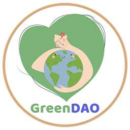

<div style="display:flex;flex-direction:column; align-items:center;">


</div>


# GreenDAO

## Track
Intermediate Track - Sustainable and Green Finance


## Introduction

**GreenDAO:** GreenDAO - Maximize community impact through decentralized finance


### Problem to be solved - solution
See the presentation we made for the project: [GreenDAO Presentation]( https://www.canva.com/design/DAGSWTEWA98/J3qeVZo0oGd-xyEQX8aJ_w/edit?utm_content=DAGSW)
Community is key for many organisations, specially like NGOs and small organisations. Based on experience and research we found four difficulties:

- Engage and giving members a voice
- Onboard and getting new users (scale)
- The payment and processes are not always transparent for donators
- Get revenue to achieve goals as community

That's why we created: GreenDAO: DAO as a service, to Empower Your Community with Trust

GreenDAO is an innovative Software-as-a-Service (SaaS) platform designed to empower communities with trust through the utilisation of a decentralized autonomous organization (DAO) framework. GreenDAO is integrated with the Hedera infrastructure with the principles of transparency, collaboration, and fairness. GreenDAO enables communities to govern themselves, make decisions collectively, have a transparency payments process and build trust-based ecosystems. Everything in just a couple clicks. Start your DAO today and give everyone in your community a voice.

At its core, GreenDAO serves as a digital infrastructure that facilitates community-led decision-making processes. It leverages blockchain technology to ensure a secure and tamper-resistant environment where participants can engage in transparent governance. By removing intermediaries and centralized authorities, GreenDAO empowers communities to have full control over their operations, enabling them to create a more inclusive and equitable ecosystem.

GreenDAO offers a user-friendly interface that simplifies the management of DAOs, allowing community members to participate and contribute effectively. Through the platform, users can propose, discuss, and vote on various matters, ranging from policy changes, resource allocation, project funding, and even strategic direction. This inclusive decision-making process fosters trust and cooperation among community members, enhancing their sense of ownership and engagement.

By utilising GreenDAO, communities can unlock numerous benefits. They can harness the collective intelligence and diverse perspectives of their members, leading to better decision-making and innovation. Furthermore, GreenDAO promotes inclusivity by providing equal opportunities for participation and influence, irrespective of geographical location or social status. This democratization of power fosters trust, engagement, and a shared sense of purpose among community members.
a
## Technical Description
In GreenDAO, we have integrated Metamask wallet. We have used solidity language for smart contract. And then we are using hardhat to deploy to the hedera testnet network. Using ether.js we are retrieving and sending transactions. We have integrated grape js. Which allow users to customize their pages like wix.com. The code is written in the next js. 
1. Smart Contract is located in [Soldiity code](./contracts/contracts/GreenDAO.sol). It is deployed with Hardhat to Hedera Testnet network. 
2. [Ether Contract Instance](./services/ERC20Singleton.js) and [Use Contract](./services/useContract.js)
3. Implementing it in all [pages](./pages) 


**Features**
1. **Dao:** In GreenDAO, organizations can create DAO. There, other people can join by purchasing a DAO subscription. There, the organization can customize the DAO page as he wishes.
2. **Goal:** Inside DAO, joined people can create Goal with a budget.
3. **Ideas:** In the Goals, other people can create ideas about the Goal. In these ideas, other people can donate, vote and also comment and reply.
4. **Profile and Badges:** In the profile page, there can be seen what that person has done, such as top donation ideas, his created daos, goals, message read, total donated etc. Also, There are different badges. Which users can earn by creating dao, joining dao, creating goals, ideas,  donating, voting and comments etc.


**Next Steps integration with Hedera:**
1. Integrate Hashpack wallet
2. Custom subdomain for each dao
3. Feed section in DAO page
4. Members list in DAO page
5. AI Generate 
6. Deploy to Mainnet


## Architecture
Hedera, Testnet, Solidity, Metamask, grape js, Web3, Ether js, Next js, TypeScript, Javascript, CSS, SCSS


## Team info
1. **Zakir Hossain:** Senior Web3 developer, blockchain expert
2. **Igor:** Design, UX/UI

## Demo materials

### Pitch Video Link
[Watch the Pitch Video](https://vimeo.com/1040628994?share=copy)

### Presentation
For more information, please see the presentation: [GreenDAO Presentation](https://www.canva.com/design/DAGSWTEWA98/J3qeVZo0oGd-xyEQX8aJ_w/edit?utm_content=DAGSW)

### Demo Link (product is live)
[Visit GreenDAO](https://greendao-hedera.vercel.app/)


## Getting Started

First, run :

```bash
npx yarn
```


Then, run the development server:

```bash
npm run dev
# or
npx yarn dev
```

